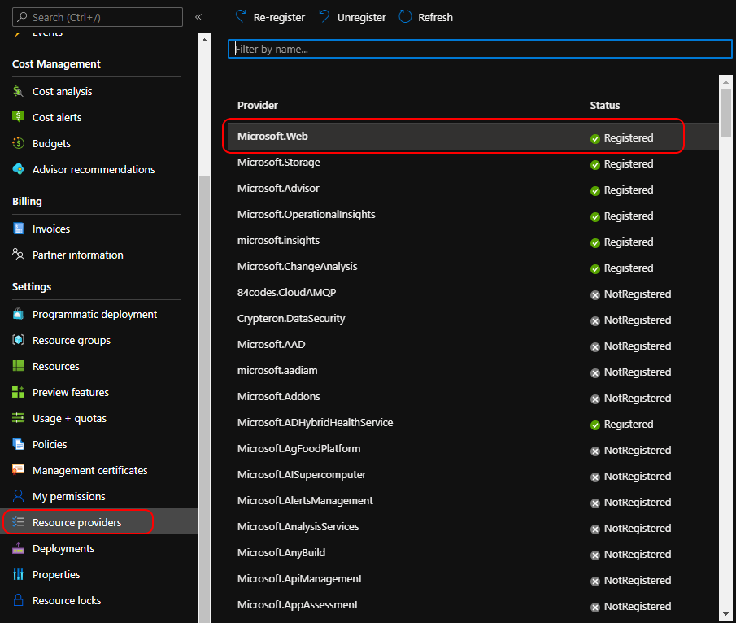

# Deploying Spring Petclinic Angular on Azure Worker Apps

## Angular frontend for Spring Petclinic on Azure Worker Apps


Warning: **client only**. 
  Use REST API from backend deployed on Azure Spring Cloud [spring-petclinic-rest project](https://github.com/spring-petclinic/spring-petclinic-rest). Following steps need to be done before deploying this project 
1) You need to deploy Spring petclinic rest project on Azure Spring Cloud and assign a public end point. 
2) Copy the Assigned end point and modify the code in **environment.ts** and **environment.prod.ts** for production deploy.

### Build

```
git clone https://github.com/selvasingh/spring-petclinic-angular.git
cd spring-petclinic-angular
git checkout Azure
ng build 
```

Run `ng build` to build the project. The build artifacts will be stored in the `dist/` directory. Use the `-prod` flag for a production build.

You can also build the application in a dedicated docker image using the provided `Dockerfile` as follows:

```
docker build -t spring-petclinic-angular:latest .
```

Then you will be able to use it as follows:

```
docker run --rm -p 8080:8080 spring-petclinic-angular:latest
```
After running the docker client locally the application should be able to hit the exposed rest end point of the Spring Petclinic Rest project
 


## Publish container image

 1. [Install docker](https://docs.docker.com/engine/install/)
 2. Open a shell and cd to the same directory as this README.
 3. Export a variable with your registry name:

```cli
export REGISTRY=myregistry
```

 4. Run the following Docker commands to build, tag, and publish the image from the `httpapi` directory:

```cli
docker build -t spring-petclinic-angular -f Dockerfile .
docker tag spring-petclinic-angular $REGISTRY/spring-petclinic-angular:latest
docker push $REGISTRY/spring-petclinic-angular:latest
```

Deploy to Azure Worker Apps
After building and testing locally with the Dockerfile, you can now deploy the application to Azure Worker Apps service. Following are the steps needed to deploy to worker apps.
 
### Create Worker Apps Environment
### Prerequisites

### Install the CLI and extensions
 [Install](https://docs.microsoft.com/cli/azure/install-azure-cli) the Azure CLI to run CLI reference commands. 

- If you're using a local installation, sign in to the Azure CLI by using the [az login](https://docs.microsoft.com/cli/azure/reference-index?view=azure-cli-latest#az_login) command. To finish the authentication process, follow the steps displayed in your terminal. For additional sign-in options, see [Sign in with the Azure CLI](https://docs.microsoft.com/cli/azure/authenticate-azure-cli).

 - Run [az version](https://docs.microsoft.com/cli/azure/reference-index?#az_version) to find the version and dependent libraries that are installed. To upgrade to the latest version, run [az upgrade](https://docs.microsoft.com/cli/azure/reference-index?#az_upgrade).

Install the **Azure Worker Apps extension**

Before installing the Azure Worker Apps CLI extension, please ensure that an older verison of the extension is not installed:

```azurecli-interactive
az extension remove -n workerapp
```

Install the latest version of the extension with the following command:

```azurecli-interactive
az extension add --source https://workerappscliextension.blob.core.windows.net/azure-cli-extension/workerapp-0.1.3-py2.py3-none-any.whl
```

For more information about extensions, see [Use extensions with the Azure CLI](https://docs.microsoft.com/cli/azure/azure-cli-extensions-overview).

### Register the Microsoft.Web Resource Provider

Ensure that your subscription has the Microsoft.Web resource provider registered. If you've used Azure App Service or Azure Funtions in the past, then you already have Microsoft.Web registered. 

In the Azure Portal under **Subscriptions**, go to the subscription that you will use to deploy Azure Worker Apps. In the Settings section, go to **Resource Providers** and ensure the `Microsoft.Web` resource provider is registered



### Define Resource Creation Parameters

To follow along with the Azure CLI commands in this quick start guide, set the following  environment variables in your terminal:

```
export RESOURCE_GROUP_NAME=workerapps-rg # All the resources would be deployed in this resource group
export RESOURCE_GROUP_LOCATION="eastus" # The resource group would be created in this location
export LOG_ANALYTICS_WORKSPACE_NAME="workerappslogs" # Workspace to export application logs
export WORKERAPPS_ENVIRONMENT_NAME="workerappsenvironment" # Name of the WorkerApps Environment
```

### Create a resource group

Azure Worker Apps, like all Azure resources, must be deployed into a resource group. Resource groups allow you to organize and manage related Azure resources.
First, create a resource group as defined in the resource parameters above with the following [az group create](https://docs.microsoft.com/cli/azure/group?view=azure-cli-latest#az_group_create) command:
```azurecli-interactive
az group create --name $RESOURCE_GROUP_NAME --location "$RESOURCE_GROUP_LOCATION"
```

### Set up your environment

Azure Worker Apps uses Log Analytics for application logs. If you have a Log Analytics workspace already, you'll need the workspace ID and key. If you don't have a Log Analytics workspace, you can create one by running the following command: 

```azurecli-interactive
az monitor log-analytics workspace create -g $RESOURCE_GROUP_NAME -n $LOG_ANALYTICS_WORKSPACE_NAME
```

You can retrieve the Log Anaytics Client Id and Client Secret using:
```bash
export LOG_ANALYTICS_WORKSPACE_CLIENT_ID=`az monitor log-analytics workspace show --query customerId -g $RESOURCE_GROUP_NAME -n $LOG_ANALYTICS_WORKSPACE_NAME | tr -d '"'`
export LOG_ANALYTICS_WORKSPACE_CLIENT_SECRET=`az monitor log-analytics workspace get-shared-keys --query primarySharedKey -g $RESOURCE_GROUP_NAME -n $LOG_ANALYTICS_WORKSPACE_NAME | tr -d '"'`
```

For more information on creating and configuring a Log Analytics workspace, see [Create a Log Analytics workspace with Azure CLI 2.0](https://docs.microsoft.com/en-us/azure/azure-monitor/logs/quick-create-workspace-cli)


## Create a Worker App Environment

Azure Worker Apps must be deployed into a Worker App Environment. You can deploy multiple Worker Apps into an environment. The environment represents a boundary for your applications. Applications deployed to the same environment share a VNET and write logs to the same Log Analytics workspace.

To create the environment, run the following command: 

```azurecli-interactive
az workerapp env create -n $WORKERAPPS_ENVIRONMENT_NAME -g $RESOURCE_GROUP_NAME --logs-workspace-id $LOG_ANALYTICS_WORKSPACE_CLIENT_ID --logs-workspace-key $LOG_ANALYTICS_WORKSPACE_CLIENT_SECRET --location "Central US EUAP"
```

## Create a Worker App

Now that you have an environment created, you can start deploying Worker Apps to it. To create a Worker App with the Azure CLI, provide the environment name, an application name, and a container image to the [az workerapp create] command. In this example, we will use spring-petclinic-angular:latest that we built above. 

You can expose your Worker Apps to the internet by specifying the `--ingress` option.

```azurecli-interactive
az workerapp create --name petclinic --resource-group $RESOURCE_GROUP_NAME --environment $WORKERAPPS_ENVIRONMENT_NAME --image $REGISTRY/spring-petclinic-angular:latest --target-port 8080 --ingress 'external'
```

Within a few seconds, you should get a response from the Azure CLI indicating that the deployment has completed with application's FQDN.

Alternatively, you can check the application's fully qualified domain name (FQDN) and its provisioning state using the `az workerapp show` command:

```azurecli-interactive
az workerapp show --resource-group $RESOURCE_GROUP_NAME --name myApp --query "{FQDN:configuration.ingress.fqdn,ProvisioningState:provisioningState}" --out table
```

Browse the application's FQDN in your browser and you should see the Spring Petclinic Angular frontend. 

Congratulations! You've successfully deployed a Worker App to Azure. Worker Apps can automatically scale out to handle the received requests, then scales in when demand decreases.
